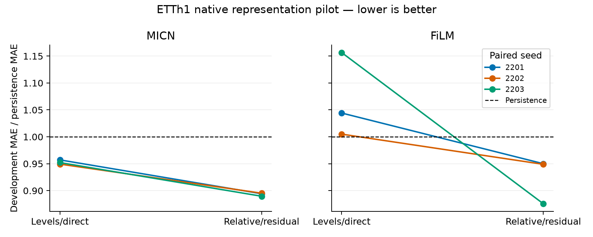

# ETTh1 native development results

Relative/residual improved all six paired comparisons. Median paired development-MAE reductions were 6.57% for MICN and 9.02% for FiLM.

All twelve authorized native fits completed on Modal L4s in waves of two. This stage compares levels/direct prediction with the relative-input, persistence-residual package; it does not replace internal layers with HyperDense.

The frozen task uses all seven ETTh1 channels, OT as target, a 32-hour context and five-hour horizon. Training and inner checkpoint selection precede the 2,876 development origins from 26 June through 23 October 2017. These dates are now exposed development data. Final-test tensors were absent from the worker bundle and no final-test scores were computed.

## Forecasting results

Raw-unit development MAE: persistence **1.091113**; 24-hour seasonal persistence **1.973376**. Positive reductions mean improvement. Medians summarize three paired seeds, not independent forecast observations.

| Backbone | Formulation | Median MAE | MAE range | Median reduction vs persistence | Parameters |
|---|---|---:|---:|---:|---:|
| MICN | levels_direct | 1.038894 | 1.035763–1.044313 | 4.79% | 82,636 |
| MICN | relative_residual | 0.975685 | 0.970664–0.976819 | 10.58% | 82,636 |
| FiLM | levels_direct | 1.139332 | 1.096511–1.261915 | -4.42% | 6,292,599 |
| FiLM | relative_residual | 1.035357 | 0.955451–1.036609 | 5.11% | 6,292,599 |

| Backbone | Seed | Relative MAE reduction vs direct | Relative MSE reduction vs direct | Inner MAE reduction vs direct | MAE reductions across chronological thirds |
|---|---:|---:|---:|---:|---|
| micn | 2201 | 6.57% | 9.08% | -0.04% | 10.54%, 2.61%, 5.76% |
| micn | 2202 | 5.69% | 8.99% | 2.17% | 5.52%, 5.59%, 5.98% |
| micn | 2203 | 6.57% | 4.31% | -2.62% | 8.52%, 4.65%, 6.22% |
| film | 2201 | 9.02% | 13.06% | 7.43% | 13.66%, 7.44%, 4.97% |
| film | 2202 | 5.58% | 5.73% | 4.29% | 9.56%, 4.99%, 1.42% |
| film | 2203 | 24.29% | 46.99% | 9.49% | 39.12%, 13.46%, 11.92% |

The chronological thirds are descriptive post-hoc checks. Forecast windows and leads overlap; they are not independent samples, and no significance claim is made. This comparison changes relative inputs, residual prediction and head initialization together, so it cannot attribute an effect to any one component.

## Horizon detail

Relative/residual MAE reduction versus persistence by forecast lead. Negative values mean the model is worse. Aggregate improvements do not imply superiority at every lead.

| Backbone | Seed | +1 hour | +2 hours | +3 hours | +4 hours | +5 hours |
|---|---:|---:|---:|---:|---:|---:|
| micn | 2201 | -6.72% | 6.98% | 10.20% | 15.18% | 16.06% |
| micn | 2202 | 1.65% | 2.15% | 10.39% | 15.07% | 15.13% |
| micn | 2203 | 3.03% | 5.68% | 11.43% | 13.83% | 14.80% |
| film | 2201 | -26.35% | 6.65% | 2.21% | 11.52% | 13.17% |
| film | 2202 | -7.40% | 1.46% | 6.07% | 7.40% | 9.70% |
| film | 2203 | -2.77% | 8.16% | 12.79% | 15.64% | 18.15% |

## Selection and convergence

All fits use Adam at 0.001, batch 32, MAE training, strict inner-MAE checkpoint selection, a 150-epoch ceiling and patience 20. Development scores were computed after selection and did not affect the training run.

| Backbone | Seed | Formulation | Best epoch | Epochs run | Stale epochs | Worker seconds |
|---|---:|---|---:|---:|---:|---:|
| micn | 2201 | levels_direct | 26 | 46 | 20 | 120.1 |
| micn | 2201 | relative_residual | 5 | 25 | 20 | 64.1 |
| micn | 2202 | levels_direct | 33 | 53 | 20 | 142.9 |
| micn | 2202 | relative_residual | 8 | 28 | 20 | 74.7 |
| micn | 2203 | levels_direct | 26 | 46 | 20 | 122.1 |
| micn | 2203 | relative_residual | 14 | 34 | 20 | 91.9 |
| film | 2201 | levels_direct | 49 | 69 | 20 | 490.5 |
| film | 2201 | relative_residual | 5 | 25 | 20 | 233.2 |
| film | 2202 | levels_direct | 62 | 82 | 20 | 730.5 |
| film | 2202 | relative_residual | 37 | 57 | 20 | 536.0 |
| film | 2203 | levels_direct | 24 | 44 | 20 | 377.6 |
| film | 2203 | relative_residual | 21 | 41 | 20 | 370.4 |

Fits not exhausting patience: **0**. Early stopping is evidence of the specified stopping rule being met, not proof of global optimization convergence. Worker times include training, per-epoch checkpoint writes and evaluation; they are not inference benchmarks.

## CPU portability diagnostic

A separate post-hoc CPU replay covered all development forecasts from all twelve checkpoints. 3 fits failed the fixed pointwise tolerance (rtol 2e-4, atol 2e-5); maximum forecast difference was 0.007628 raw units, and maximum absolute aggregate MAE change was 0.00002023. The fixed tolerance was not widened. CPU versus CUDA numerical execution may explain the differences, but the exact source was not isolated. The CPU paired rankings are recorded alongside the L4 rankings; L4 remains the frozen primary evaluation. This limits claims of cross-device numerical equivalence and does not replace the successful same-device selected-checkpoint replay.

## Controls, artifacts and budget

The return audit passed all twelve archives and 172,560 saved forecast values. It checks frozen targets, origins and both baselines; recomputes MAE/MSE/bias and lead scores; verifies checkpoint hashes and metadata; and checks selected weights against the best state stored in the latest resumable checkpoint. Each worker also reloaded its selected checkpoint and reproduced inner MAE within tolerance.

Every fit archives best inference weights plus latest model, Adam, Python/NumPy/Torch/CUDA RNG, sampler, best-state and training-history state. Exact CPU resume was tested; exact CUDA continuation has not been established. Historical frozen inputs and the current source archives passed preservation checks. The eleven focused wrapper/training tests passed before launch.

The new **$19 allocation conservatively accounts for $14.221020**, retaining timeout-based reservations even when fits finish early. This is not the final invoice. The $1 protected reserve is not spent; prior allocations remain closed. There were no failed attempts or retries. No larger paid stage or final-test evaluation was launched.

- [Audited results, per-lead metrics and archive hashes](../results/etth1-transfer/development-001/analysis.json)
- [Full CPU checkpoint replay](../results/etth1-transfer/development-001/cpu-replay.json)
- [Allocation ledger](../results/etth1-transfer/development-001/ledger.json)
- [Frozen stage plan](../results/etth1-transfer/development-prepared-v1/plan.json)
- [Source preservation audit](../results/etth1-transfer/development-001/source-preservation-audit.json)
- [Calibration and launch protocol](etth1_calibration_results_and_development_plan.md)

## Interpretation and next scope

The package meets the proposed representation advancement rule on this development dataset: both models improve in at least two of three paired seeds and all fits complete the stopping checks. Freeze relative/residual for subsequent development comparisons; retain both models and all eight arms.

This is evidence about native-model representation, not hypercomplex algebra. MICN inner selection scores are mixed despite consistent development improvement. ETTh1 is one public dataset on a custom short-horizon task, and additional seeds on these dates would remain development evidence.

The next implementation needs native, controlled real, 2D/4D/8D and exactly budget-matched rank controls on the seven-channel wrapper; equal AdamW learning-rate/weight-decay/selected-operator-initialization settings; untouched-weight pairing; forward/gradient and reconstruction checks; and explicit compute-precision recording. The current Adam-only development runner does not implement that grid. Keep inference-only optimizations separate.

An analytic site inventory found MICN 8D would save only 1.0843% of whole-model parameters versus native. FiLM 4D would save 16.6636%, and FiLM 8D 24.99546% versus its already-complex native model. Thus none of these single-site replacements can meet a literal 25% native-relative compression threshold. Do not round 24.99546% into a threshold pass. Savings against expanded controlled-real FiLM are larger and must be identified as a different baseline. Retain the original threshold for that claim or prospectively define a different question before any new scored comparison. These are analytic parameter counts, not tested seven-channel HyperDense models.

Recalibrate all arms before proposing a new full-stage budget: native timing cannot price spectral HyperDense or low-rank execution reliably. The former $48 estimate is not valid for this workload. The final-test period remains untouched until model/settings, contrasts and analysis are frozen; no paid tuning or final-test launch follows automatically.

- [Next control sites and analytic parameter budgets](../results/etth1-transfer/development-001/next-control-site-inventory.json)
