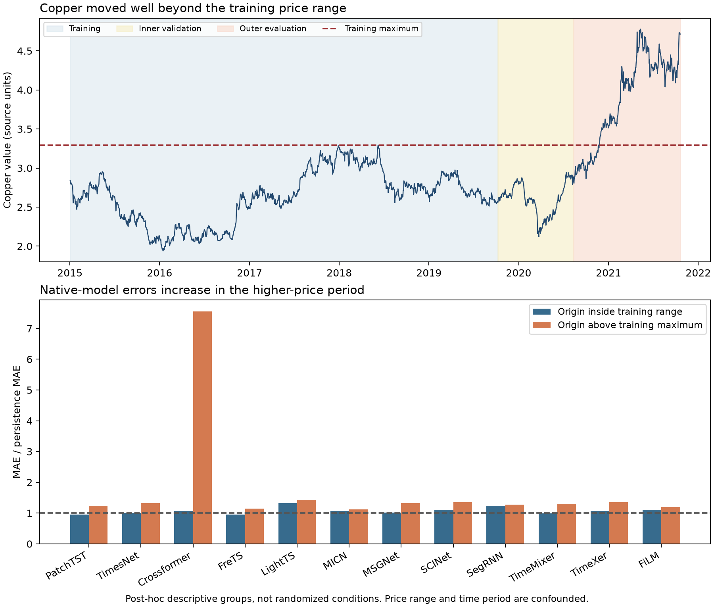

# HyperDense follow-up: implementation and persistence diagnostics

Completed locally on 11 September 2026. No Modal inference or training jobs were launched. The completed studies, their frozen source files, budget ledgers and paused monitor remain unchanged. New implementation variants are isolated inference-only prototypes in `scripts/profile_hyperdense_followup.py`.

## Findings that change the next experiment

**Inference overhead is measurable locally.** Across 63 matched layer cases on the Apple GPU (seven study-derived shape/bias combinations, three algebras and three batch sizes), caching constants produced a median 2.93× speedup. Pre-expanding the learned hypercomplex map into an ordinary dense matrix produced a median 13.55× layer speedup. These are ratios across microbenchmarks, not end-to-end application speedups or estimates for L4.

**The evaluation period differs sharply from training.** Copper training values ranged from 1.9395 to 3.2930; evaluation values reached 4.7785. About 75.75% of evaluation rows were above the training maximum. Three other observed series also frequently lay outside their training ranges. This is a distribution-shift hypothesis supported by descriptive evidence, not a demonstrated sole cause of forecast errors.

**The models learn, but their forecasts transfer poorly.** Eighteen of 96 arms beat persistence on inner-validation MSE, yet all 96 lost on outer MAE. All twelve native models and 95 of 96 total arms had negative average forecast bias. Native Crossformer illustrates the problem: MAE/persistence was 1.07 when the forecast origin was within the training price range and 7.55 when it was above that range. Those subgroups are also different time periods, so this is not a causal experiment.

## Implementation experiment

The original algebra constants are CPU float64 tensors outside the module buffer registry. Every float32 forward requests a dtype conversion; accelerator forwards also request device transfer. The CPU operator trace counted 20 `aten::_to_copy` calls over 20 original forwards and none for the cached implementation. Both contraction implementations still used two `bmm` calls per forward, while dense export used one `addmm`. The profiler is for attribution only; separate unprofiled runs supply latency measurements.

Each case used identical weights and inputs across original, cached-constant and dense-export implementations, five warm-up calls, five rounds with shuffled implementation order and fifteen calls per round. Inputs were resident before timing; CPU used two threads, MPS synchronized at timing boundaries. All 126 device/shape/algebra/batch cases passed float32 equivalence checks (atol 2e-5, rtol 2e-4). Twelve float64 basis/leading-axis checks also passed at 1e-12. Seven focused tests additionally check gradients with respect to inputs, immutable export snapshots and an active selected layer in the full MICN graph.

Full-graph checks used freshly initialized MICN 8D and FiLM 4D on CPU, batch sizes 1 and 32. Archived trained weights were not available, so these are not reruns of trained checkpoints. Existing saved forecasts remain the evidence for forecasting accuracy. Selected layers were verified to affect model outputs.

| CPU full model | Batch | Original ms | Cached ms | Dense export ms |
|---|---:|---:|---:|---:|
| MICN octonion | 1 | 0.774 | 0.739 | 0.692 |
| MICN octonion | 32 | 15.744 | 15.725 | 15.964 |
| FiLM quaternion | 1 | 12.465 | 12.550 | 10.704 |
| FiLM quaternion | 32 | 39.881 | 39.861 | 36.835 |

FiLM dense export reduced whole-model CPU latency by about 14.1% at batch 1 and 7.6% at batch 32. MICN showed no clear gain at batch 32; timing ranges overlapped. Most model computation is outside the selected layer. Expanding FiLM increased registered parameter/buffer storage from 21,993,028 to 34,575,940 bytes. These counts exclude activations, allocator overhead and unregistered shared algebra tensors; they are not peak process memory. Caching preserves compact weights; dense export trades resident storage for simpler execution. Exported weights must be regenerated after any training update.

## Data, target and learning checks

Recomputed 142,560 saved forecast rows across all 96 arms against source data: target dates, lead alignment, forecast origins and persistence were correct. Maximum raw-target reconstruction discrepancy was 1.61e-7, consistent with float32 scaling roundoff; persistence exactly matched the raw origin price. Training-only scaler values and chronological target partitions matched all saved audits. No target clipping was found in the inspected preparation/inverse-scaling path. These checks do not prove every component of each model is bug-free.

| Partition | Dates | Forecast origins | Persistence MAE | Copper rows above training maximum |
|---|---|---:|---:|---:|
| train | 2015-01-02–2019-10-08 | 1158 | 0.04133 | 0.0% |
| inner | 2019-10-09–2020-08-10 | 207 | 0.04339 | 0.0% |
| outer | 2020-08-11–2021-10-19 | 297 | 0.07764 | 75.7% |

Eighty-eight of 96 arms lost to persistence at every individual forecast lead. Ten selected their final executed epoch, so incomplete training remains possible, but simply adding epochs does not address the observed change in data distribution. Training and checkpoint selection optimized MSE whereas the headline metric is MAE; both should be reported and the selection objective specified in the next protocol.

## Small CPU baseline probes

Fitted ridge regressions only on the 1,158 actual training windows, predicting a correction to persistence. One used flattened level inputs; the other subtracted each feature’s latest observation from its history before flattening. Both used the same train-only standardization and seven fixed ridge penalties (0.01 to 10,000), selected by inner MSE. No outer score selected a penalty. A drift baseline used only the average training price change. These are post-hoc diagnostic probes, not independent evidence of predictive superiority.

| Probe | Selected penalty | Inner MAE / persistence | Outer MAE / persistence |
|---|---:|---:|---:|
| ridge_residual_levels | 10000.0 | 1.0399 | 1.1356 |
| ridge_residual_relative_to_latest | 10.0 | 0.9830 | 1.0147 |
| train_mean_drift | — | 1.0029 | 1.0015 |

The relative-input ridge reduced inner MSE by 9.65% versus persistence, but outer MAE was still 1.47% worse. The level-input ridge was 13.56% worse on outer MAE and chose the largest available penalty, signalling a boundary optimum in that small search. This supports testing level-relative features and a persistence residual head; it does not show that preprocessing fixes the neural models.

## Next action

Validate cached constants and exported dense maps on L4 before making GPU performance claims. For accuracy, first run a small native-model representation pilot with identical observations and a shared residual-output formulation. Only advance to hypercomplex tuning if the pilot gives useful evidence. Preserve all algebra/control arms within the selected models, record the selection of MICN/FiLM as post-hoc, and use fresh data for any independent confirmation.

[Costed conditional study plan](hyperdense_followup_plan.md). [Machine-readable diagnostics](../results/hyperdense-followup-local/persistence-diagnostics.json). [Timing measurements and profiles](../results/hyperdense-followup-local/inference.json).
