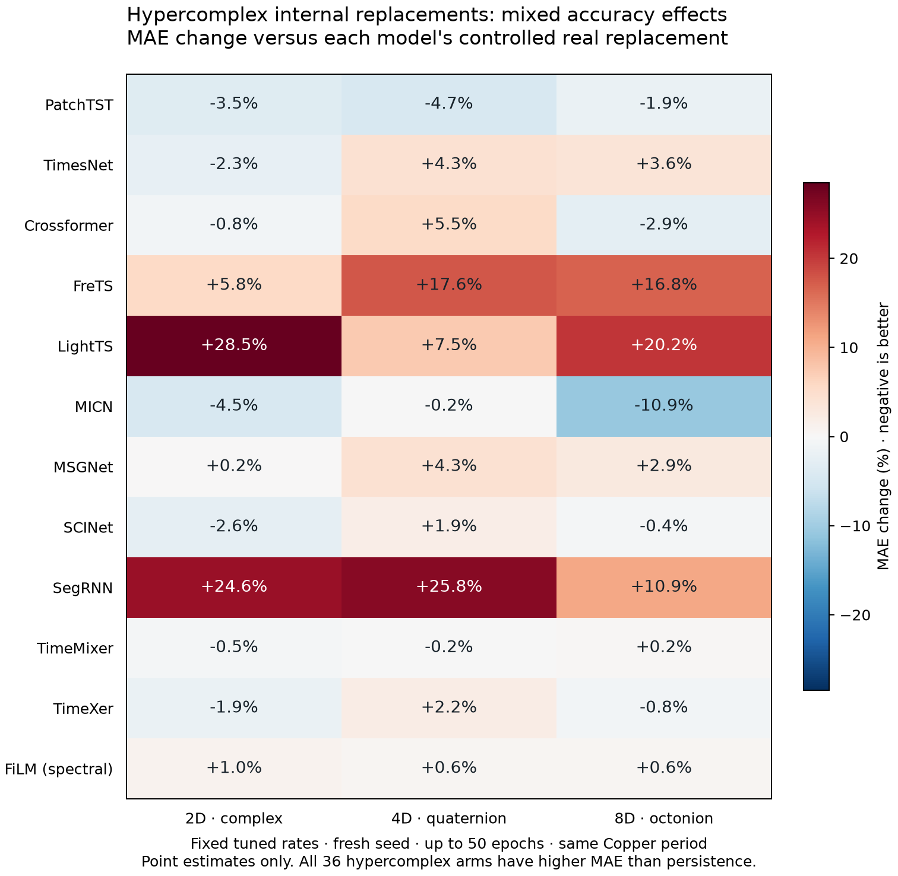

# Internal HyperDense replacement: completed remaining-model study

Results recorded 11 September 2026. **No consistent accuracy advantage or universal winning dimension emerged.** Some replacements improved the controlled real arm, but every hypercomplex follow-up arm lost to persistence on mean absolute error. Parameter compression is measurable; it did not generally produce faster inference.

## Scope and tuning

The expansion covered twelve remaining pinned TSLib backbones. DLinear, TSMixer and iTransformer were excluded as requested. This does not cover every other model family or hybrid preset in the application. These are selected internal-layer replacements, not an extra hypercomplex input layer, and not a replacement of every dense layer. FiLM is a separately labelled spectral intervention; its native operator is already complex.

Each backbone had eight arms: native, controlled real replacement, 2D/4D/8D HyperDense and three corresponding approximate parameter-budget low-rank controls. Untouched weights were paired, with the same features, chronological splits, scaler fitting, surrounding architecture and external head.

**192 tuning fits:** 12 backbones × 8 arms × learning rates 0.0003 and 0.001, seed 701, maximum 25 epochs. Each arm received the same search opportunity. The best development MAE selected its rate, with the lower rate preferred for relative ties within 0.1%.

**96 follow-up fits:** all arms retained, rates frozen, fresh seed 401, maximum 50 epochs. Context 32, horizon 5, batch 32, patience 20 and relative checkpoint threshold 0.001 were held fixed. Checkpoints were selected on a chronological inner split and restored before scoring. All 96 fits passed artifact, initialization, split/scaler, checkpoint and prediction-metric audits. Ten chose their final executed epoch; 25 stopped before epoch 50. This does not establish full convergence.

Only learning rate was searched. Width, dropout, weight decay, initialization scaling and other hyperparameters were not broadly tuned. Equal tuning is necessary for a fair comparison, but this small grid does not establish each arm's achievable optimum.

## Full dimension comparison

MAE divided by persistence MAE; **lower is better and below 1 would beat persistence**. The controlled real arm is the matched replacement baseline; native preserves the model's original operator and initialization. They answer different comparisons.

| Backbone | Native | Real | 2D | 4D | 8D | Low-rank 2 | Low-rank 4 | Low-rank 8 |
|---|---:|---:|---:|---:|---:|---:|---:|---:|
| PatchTST | 1.188 | 1.243 | 1.199 | 1.185 | 1.219 | 1.261 | 1.162 | 1.244 |
| TimesNet | 1.279 | 1.283 | 1.253 | 1.338 | 1.328 | 1.330 | 1.342 | 1.424 |
| Crossformer | 6.494 | 7.069 | 7.014 | 7.456 | 6.866 | 6.449 | 7.615 | 6.610 |
| FreTS | 1.114 | 1.242 | 1.314 | 1.461 | 1.451 | 1.191 | 1.157 | 1.323 |
| LightTS | 1.410 | 1.656 | 2.127 | 1.779 | 1.991 | 2.374 | 1.604 | 1.600 |
| MICN | 1.117 | 1.313 | 1.254 | 1.310 | 1.170 | 1.393 | 1.835 | 1.242 |
| MSGNet | 1.275 | 1.291 | 1.293 | 1.347 | 1.328 | 1.285 | 1.281 | 1.383 |
| SCINet | 1.314 | 1.261 | 1.227 | 1.285 | 1.255 | 1.194 | 1.207 | 1.394 |
| SegRNN | 1.262 | 1.027 | 1.280 | 1.292 | 1.139 | 1.221 | 1.188 | 1.188 |
| TimeMixer | 1.250 | 1.255 | 1.249 | 1.253 | 1.258 | 1.259 | 1.252 | 1.256 |
| TimeXer | 1.302 | 1.255 | 1.231 | 1.283 | 1.245 | 1.226 | 1.344 | 1.231 |
| FiLM (spectral) | 1.188 | 1.175 | 1.187 | 1.181 | 1.182 | 1.184 | 1.167 | 1.168 |

Among hypercomplex arms, 2D has the lowest point MAE on six backbones, 4D on three and 8D on three. At least one dimension beats controlled real on seven of twelve backbones by point estimate. These winner counts are descriptive and do not establish a statistically superior dimension.

## What survived the follow-up

MICN 8D reduced MAE by **10.87% versus controlled real**. Its simultaneous interval excluded zero at each tested block length (30, 60 and 120), the clearest such signal against that control. However, it was **4.78% worse than native MICN** and **17.01% worse than persistence**. Thus it is evidence for a particular replacement comparison, not a practical forecasting win.

PatchTST 2D improved controlled real by 3.54%; its adjusted interval excluded zero at the primary block length 60, but not at length 30. PatchTST 4D had a better point score than 2D, illustrating why point winners and uncertainty conclusions must be separated. No hypercomplex arm beat persistence on point MAE, let alone a favourable adjusted interval. In fact all 96 follow-up arms lost to persistence; the closest was SegRNN controlled real at 1.027 times persistence MAE.

Some large development gains did not survive: FreTS 4D changed from roughly 9.7% better than controlled real to 17.6% worse, while SegRNN 8D changed from 29.9% better to 10.9% worse. Because both seed and maximum epochs changed, this cannot be attributed to either alone. It shows why short-run rankings were insufficient.

## Compression and measured inference

The following selects each backbone's lowest-MAE hypercomplex arm descriptively. Negative error changes favour that arm. Parameter reductions refer to the entire model, not just the replaced layer. Inference ratios above 1 mean slower than controlled real.

| Backbone | Best dimension | MAE change vs real | MAE change vs native | Parameters saved vs real | Inference time / real |
|---|---|---:|---:|---:|---:|
| PatchTST | 4D | -4.66% | -0.29% | 5.53% | 1.29× |
| TimesNet | 2D | -2.27% | -1.99% | 0.70% | 1.11× |
| Crossformer | 8D | -2.88% | +5.72% | 1.11% | 1.01× |
| FreTS | 2D | +5.76% | +17.94% | 46.65% | 1.25× |
| LightTS | 4D | +7.45% | +26.19% | 5.94% | 1.30× |
| MICN | 8D | -10.87% | +4.78% | 1.10% | 1.16× |
| MSGNet | 2D | +0.19% | +1.46% | 0.76% | 1.22× |
| SCINet | 2D | -2.63% | -6.61% | 8.02% | 0.93× |
| SegRNN | 8D | +10.94% | -9.72% | 2.92% | 1.37× |
| TimeMixer | 2D | -0.48% | -0.12% | 3.07% | 1.03× |
| TimeXer | 2D | -1.92% | -5.45% | 2.54% | 1.15× |
| FiLM (spectral) | 4D | +0.56% | -0.51% | 37.50% | 1.43× |

FiLM 4D used 37.5% fewer whole-model parameters than controlled real, with 0.56% higher point MAE and roughly 43% slower measured inference. Against already-complex native FiLM, the parameter reduction is about 16.7%. This is a possible compression trade-off, not established accuracy equivalence. Overall, 34 of 36 hypercomplex arms had slower measured batch-32 inference than controlled real. Timings are one benchmark per fit with warm-up and repeats, not independent repeated performance trials.

## Uncertainty and limits

The preregistered analysis compared 180 contrasts using 10,000 circular moving-block bootstrap resamples and family-wise 95% max-absolute centered/studentized intervals. Each observation is one forecast origin's mean absolute error over five leads; the same resampled origins are shared across comparisons. Primary block length 60 was selected using development data only, with sensitivity checks at 30 and 120. There are only 297 origins and about 4.95 effective blocks at length 60, so interval coverage is uncertain. At the primary length, 11 contrasts favoured the left arm and 70 favoured the right; only two favourable comparisons were hypercomplex versus controlled real. Seven favourable contrasts survived all three lengths, many against other compressed controls.

The Copper evaluation dates were already used for rate selection. The follow-up has only one fresh seed and a different epoch allowance. It is limited replication on reused data, not independent confirmation; do not pool the two stages as identically trained replicates. Nonsignificance is not equivalence. This study cannot show that hypercomplex layers never help, nor rank algebras universally. It tests these specific internal sites and training settings.

## Completion and budget

The additional $20 internal allocation contains 372 successful fits: 24 original-three internal pilot, 48 development, 12 remaining-model calibrations, 192 tuning and 96 follow-up. There were 109 submitted jobs, including one failed SCINet calibration attempt whose cost remains charged. The expansion alone comprises 300 successful fits. No tuning or follow-up batch failed. The original separate allocation remains closed and unchanged.

Conservative accounted spend is **$15.51 of $20**; delayed metered allocation usage is **$3.18**, not a final bill. The conservative ledger includes uncertainty and startup allowances. It leaves $4.49 against the cap, including the protected $1 reserve. The internal programme ran from approximately 05:25 to 11:51 UTC on 11 September (about 6 hours 26 minutes elapsed, not continuous billed GPU time).

The planned matrix and analysis are complete. No further useful balanced stage under the current protocol fits the remaining conservative headroom: even twelve minimum 300-second job reservations plus overhead total about $4.49, above the $3.49 available after the reserve. This is not a claim that every conceivable small experiment is impossible. Further short or selectively chosen runs on the same data would not resolve the central limitations, so training ends with funds unspent.

A future study should preregister independent data and multiple paired seeds, allocate equal tuning budgets for learning rate, regularization and initialization, and train enough to assess convergence. A focused representation-aware hypothesis should be chosen before scoring; extra tuning should not target hypercomplex arms alone. This is a recommendation for a separately scoped study, not a new launch.

## Reproducible evidence

- [Frozen tuning protocol](modal_l4_remaining_tuning_stage.md)
- [Frozen follow-up and uncertainty protocol](modal_l4_remaining_replication_stage.md)
- [Analysis with all 96 scores and 180 intervals](../results/modal-l4-internal/controller/remaining-replication-analysis.json)
- [Full 96-fit audit](../results/modal-l4-internal/controller/remaining-replication-review.json)
- [192-fit tuning audit](../results/modal-l4-internal/controller/remaining-tuning-review.json)
- [Existing literature notes](hyperdense_literature_notes.md)
